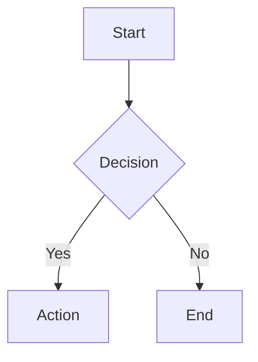

# react-craft-renderer

A rich Markdown renderer for React with interactive data tables, Mermaid diagrams, spreadsheets, JSON viewer, code syntax highlighting, and a fullscreen overlay system. Powered by Tailwind CSS 4.

## Features

- **GFM Markdown** — Full GitHub Flavored Markdown with remark/rehype plugins
- **Syntax Highlighting** — [Shiki](https://shiki.style/) with 100+ language grammars
- **Pure-TS Mermaid Engine** — Flowchart, sequence, class, ER diagrams rendered to SVG (no `mermaid.js` dependency)
- **Interactive Data Tables** — Sortable, filterable, groupable tables with badge/currency/percent column types
- **Spreadsheet Blocks** — Excel-style grid with `.xlsx` export
- **JSON Viewer** — Collapsible interactive JSON tree
- **Diff Viewer** — Unified diff rendering
- **Fullscreen Overlay System** — Code, image, PDF, Mermaid, data table previews
- **Tailwind CSS 4 Theming** — Light/dark mode with 6-color system and CSS custom properties
- **Platform Agnostic** — Context-based dependency injection for Electron/Web/Mobile

## Installation

```bash
npm install react-craft-renderer
```

### Peer Dependencies

```bash
npm install react react-dom tailwindcss
```

## Quick Start

### 1. Import the theme CSS

In your main CSS file:

```css
@import "react-craft-renderer/styles";
```

### 2. Render Markdown

```tsx
import { Markdown } from 'react-craft-renderer'

function App() {
  return (
    <Markdown
      content="# Hello World\n\nThis is **rich** markdown."
      mode="full"
    />
  )
}
```

### 3. Platform Context (optional)

Wrap your app with `PlatformProvider` to enable platform-specific actions:

```tsx
import { PlatformProvider, Markdown } from 'react-craft-renderer'

function App() {
  return (
    <PlatformProvider actions={{
      onOpenUrl: (url) => window.open(url, '_blank'),
      onCopyToClipboard: (text) => navigator.clipboard.writeText(text),
    }}>
      <Markdown content={content} mode="full" />
    </PlatformProvider>
  )
}
```

## Special Code Block Types

Beyond standard fenced code blocks with syntax highlighting, `react-craft-renderer` supports 7 special block types:

### 1. `datatable` — Interactive Data Table

Sortable, filterable, groupable data table with typed columns.

````markdown
```datatable
{
  "title": "Team Performance",
  "columns": [
    { "key": "name", "label": "Name", "type": "text" },
    { "key": "score", "label": "Score", "type": "number" },
    { "key": "status", "label": "Status", "type": "badge" },
    { "key": "growth", "label": "Growth", "type": "percent" }
  ],
  "rows": [
    { "name": "Alice", "score": 95, "status": "Active", "growth": 0.152 },
    { "name": "Bob", "score": 82, "status": "Review", "growth": -0.03 }
  ]
}
```
````

**Column types:** `text`, `number`, `currency`, `percent`, `boolean`, `date`, `badge`

### 2. `spreadsheet` — Excel-style Grid

Excel-style grid with row numbers, column letters, and `.xlsx` export.

````markdown
```spreadsheet
{
  "filename": "report.xlsx",
  "columns": [
    { "key": "item", "label": "Item", "type": "text" },
    { "key": "q1", "label": "Q1", "type": "currency" }
  ],
  "rows": [
    { "item": "Revenue", "q1": 1200000 }
  ]
}
```
````

### 3. `mermaid` — Diagrams

Rendered as themed SVGs using a pure TypeScript engine (no `mermaid.js`).

````markdown

````

Supported: `graph`, `flowchart`, `stateDiagram-v2`, `sequenceDiagram`, `classDiagram`, `erDiagram`

### 4. `json` — Interactive JSON Viewer

Collapsible JSON tree with syntax highlighting.

````markdown
```json
{
  "name": "react-craft-renderer",
  "features": ["markdown", "mermaid", "datatable"]
}
```
````

### 5. `diff` — Code Diff Viewer

Unified diff format with line-level highlighting.

````markdown
```diff
--- a/config.ts
+++ b/config.ts
@@ -1,3 +1,3 @@
-const port = 3000
+const port = 8080
```
````

### 6. `html-preview` — Sandboxed HTML Preview

```markdown
```html-preview
{ "src": "/path/to/file.html", "title": "Preview" }
```
```

### 7. `pdf-preview` — Inline PDF Viewer

Requires optional `react-pdf` dependency.

```markdown
```pdf-preview
{ "src": "/path/to/file.pdf", "title": "Document" }
```
```

## Mermaid Engine

The built-in Mermaid engine is a standalone pure-TypeScript implementation that renders diagrams to SVG without any dependency on `mermaid.js`. It uses [ELK.js](https://github.com/kieler/elkjs) for graph layout.

```ts
import { renderMermaid, renderMermaidSync } from 'react-craft-renderer/mermaid'

// Async (uses ELK worker)
const svg = await renderMermaid('graph TD\n  A --> B')

// Sync (for useMemo in React)
const svg = renderMermaidSync('graph TD\n  A --> B', {
  bg: '#1a1b26',
  fg: '#a9b1d6',
})
```

Also supports ASCII rendering for terminal environments:

```ts
import { renderMermaidAscii } from 'react-craft-renderer/mermaid'

const ascii = await renderMermaidAscii('graph TD\n  A --> B')
console.log(ascii)
```

## Overlay System

Fullscreen overlay components for previewing content:

```tsx
import {
  CodePreviewOverlay,
  ImagePreviewOverlay,
  MermaidPreviewOverlay,
  JSONPreviewOverlay,
  DataTableOverlay,
  PDFPreviewOverlay,
} from 'react-craft-renderer'
```

All overlays use Base UI Dialog for proper focus management, ESC handling, and accessibility.

## Theming

The theme is built on a 6-color system using CSS custom properties:

| Variable | Description |
|---|---|
| `--background` | Surface background |
| `--foreground` | Text and icons |
| `--accent` | Brand highlight color |
| `--info` | Warning/info states |
| `--success` | Success states |
| `--destructive` | Error states |

Mix variants (`--foreground-10` through `--foreground-95`) provide solid color interpolations between foreground and background.

Toggle dark mode by adding `.dark` class to any ancestor element.

## Render Modes

The `Markdown` component supports three render modes:

- **`terminal`** — Raw output with minimal formatting
- **`minimal`** — Clean rendering with syntax highlighting, no extra chrome
- **`full`** — Rich rendering with styled tables, code blocks, and typography

## Claude Code Skill

This package includes a `craft-md-summary` skill for [Claude Code](https://claude.com/claude-code) that generates rich Markdown summaries using all 7 special block types. See `skills/craft-md-summary/SKILL.md`.

## License

[MIT](LICENSE)
