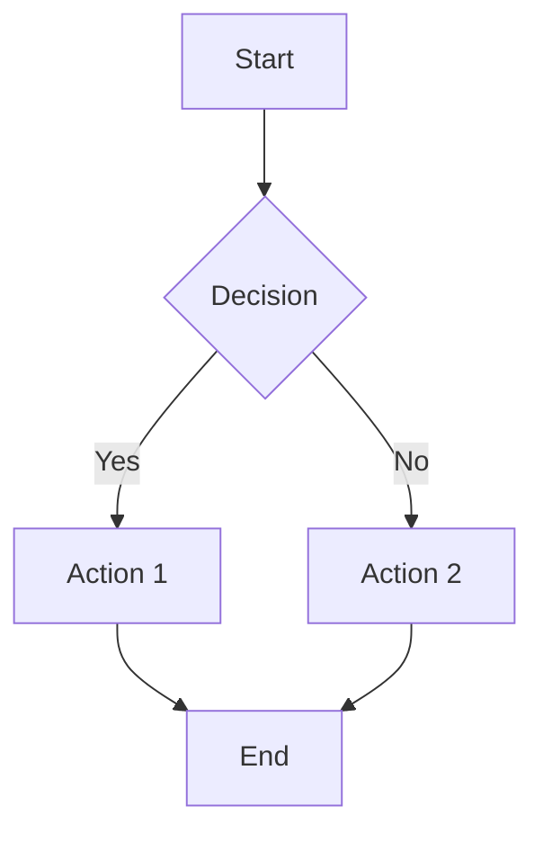

This skill generates summaries of Markdown documents in formats fully compatible with Craft Agent's rendering engine. It leverages both standard GFM markdown and Craft's 7 special code block types to produce rich, interactive summaries.

The user provides one or more Markdown files (or content) to summarize. The skill reads the content, analyzes structure, and outputs a well-formatted summary using the most appropriate Craft-compatible rendering types.

## Craft Agent Supported Rendering Types

### Standard Markdown (GFM)

All standard GitHub Flavored Markdown is supported:
- Headings: H1 (`#`) through H4 (`####`)
- Inline formatting: `**bold**`, `*italic*`, `~~strikethrough~~`, `` `inline code` ``
- Lists: unordered (`-`), ordered (`1.`), task lists (`- [x]` / `- [ ]`)
- Blockquotes: `> quote text`
- Horizontal rules: `---`
- Standard markdown tables (use only for small data, 3-4 rows max)
- Links: `[text](url)` and raw URLs (auto-linked)
- Fenced code blocks with syntax highlighting (any language)
- Collapsible sections via `<details>` / `<summary>`

### 7 Special Code Block Types

These are Craft Agent's extended rendering blocks. Use them inside fenced code blocks with the corresponding language tag.

#### 1. `datatable` - Interactive Data Table

Sortable, filterable, groupable data table. Use for structured data, comparisons, query results.

````
```datatable
{
  "title": "Optional Title",
  "columns": [
    { "key": "name", "label": "Name", "type": "text" },
    { "key": "score", "label": "Score", "type": "number" },
    { "key": "status", "label": "Status", "type": "badge" },
    { "key": "rate", "label": "Growth", "type": "percent" },
    { "key": "revenue", "label": "Revenue", "type": "currency" },
    { "key": "active", "label": "Active", "type": "boolean" },
    { "key": "date", "label": "Date", "type": "date" }
  ],
  "rows": [
    { "name": "Item A", "score": 95, "status": "Active", "rate": 0.152, "revenue": 4200000, "active": true, "date": "2025-01-15" }
  ]
}
```
````

**Column types:**

| Type | Input | Renders As | Example |
|------|-------|-----------|---------|
| `text` | Any string | Plain text | `"John"` |
| `number` | Number | Formatted with commas | `1500000` -> `1,500,000` |
| `currency` | Raw number | Dollar amount | `4200000` -> `$4,200,000` |
| `percent` | Decimal 0-1 | Colored percentage | `0.152` -> `+15.2%` |
| `boolean` | true/false | Yes/No | `true` -> `Yes` |
| `date` | ISO date string | Formatted date | `"2025-01-15"` -> `Jan 15, 2025` |
| `badge` | String | Colored status pill | `"Active"` -> green badge |

**Badge colors:** green = `active/passing/success/done`, red = `revoked/failed/error`, gray = all others.

#### 2. `spreadsheet` - Excel-style Grid

Excel-style grid with row numbers, column letters, and `.xlsx` export. Use for financial reports and exportable data.

````
```spreadsheet
{
  "filename": "report.xlsx",
  "sheetName": "Summary",
  "columns": [
    { "key": "item", "label": "Item", "type": "text" },
    { "key": "q1", "label": "Q1", "type": "currency" },
    { "key": "q2", "label": "Q2", "type": "currency" }
  ],
  "rows": [
    { "item": "Revenue", "q1": 1200000, "q2": 1450000 },
    { "item": "Cost", "q1": 800000, "q2": 750000 }
  ]
}
```
````

Supports column types: `text`, `number`, `currency`, `percent`, `formula`.

#### 3. `mermaid` - Diagrams

Rendered as themed SVGs. Use for architecture, flows, relationships, sequences.

Supported diagram types:
- Flowcharts: `graph LR`, `graph TD`, `graph RL`, `graph BT`
- State diagrams: `stateDiagram-v2`
- Sequence diagrams: `sequenceDiagram`
- Class diagrams: `classDiagram`
- ER diagrams: `erDiagram`

````

````

#### 4. `json` - Interactive JSON Viewer

Collapsible JSON tree. Use when outputting structured JSON data or API responses.

````
```json
{
  "summary": {
    "total_sections": 5,
    "key_topics": ["architecture", "performance", "security"],
    "metadata": { "author": "...", "date": "..." }
  }
}
```
````

#### 5. `diff` - Code Diff Viewer

Unified diff format. Use for showing before/after changes.

````
```diff
--- a/original.md
+++ b/modified.md
@@ -1,3 +1,3 @@
 # Title
-Old content here
+New updated content here
 More text
```
````

#### 6. `html-preview` - HTML Preview (file-based)

Sandboxed iframe HTML rendering. Requires a file path.

````
```html-preview
{
  "src": "/absolute/path/to/file.html",
  "title": "Preview Title"
}
```
````

#### 7. `pdf-preview` - PDF Preview (file-based)

Inline PDF viewer. Requires a file path.

````
```pdf-preview
{
  "src": "/absolute/path/to/file.pdf",
  "title": "Document Title"
}
```
````

## Summary Generation Rules

When summarizing a Markdown document for Craft Agent, follow these guidelines:

### Block Type Selection

1. **Use `datatable`** when the document contains:
   - Comparison data, feature matrices, benchmark results
   - Lists that can be structured as rows (e.g., API endpoints, configuration options)
   - Any data users might want to sort, filter, or group
   - Tables with more than 4 rows

2. **Use `spreadsheet`** when the document contains:
   - Financial data, budgets, numerical reports
   - Data users might want to export to Excel

3. **Use `mermaid`** when the document contains:
   - Architecture descriptions -> flowchart
   - Process/workflow descriptions -> flowchart or state diagram
   - API call sequences -> sequence diagram
   - Data model relationships -> ER diagram or class diagram
   - Component hierarchies -> class diagram

4. **Use `json`** when outputting:
   - Structured metadata about the document
   - Configuration or schema summaries

5. **Use `diff`** when:
   - Showing proposed changes to the original document
   - Highlighting key modifications between versions

6. **Use standard markdown tables** only for small, simple data (3-4 rows).

7. **Use standard markdown** for:
   - Narrative summaries and key takeaways
   - Section headers and organization
   - Bullet-point highlights
   - Blockquotes for important excerpts

### Summary Structure Template

A good Craft-compatible summary should follow this structure:

```
# [Document Title] - Summary

## Key Takeaways
- Bullet points of the most important findings

## Overview
Brief narrative summary of the document's purpose and scope.

## [Topic-specific sections with appropriate block types]

### Data/Metrics (if applicable)
-> Use datatable or spreadsheet

### Architecture/Flow (if applicable)
-> Use mermaid diagram

### Detailed Findings
-> Use markdown with headings, lists, blockquotes

## Document Metadata
-> Use json block for structured metadata
```

### Quality Guidelines

- **Prefer rich blocks over plain text** when the data structure supports it
- **Keep narrative sections concise** - use bullet points over paragraphs
- **Use headings liberally** (H2 for major sections, H3 for subsections)
- **Include a metadata json block** at the end with document stats (word count, sections, key topics)
- **Do not use html-preview or pdf-preview** unless working with actual files on disk
- **Validate mermaid syntax** mentally before outputting - keep diagrams clean and readable
- **Badge values in datatable** should use standard status words (Active/Done/Failed/Error/Success) for proper coloring
